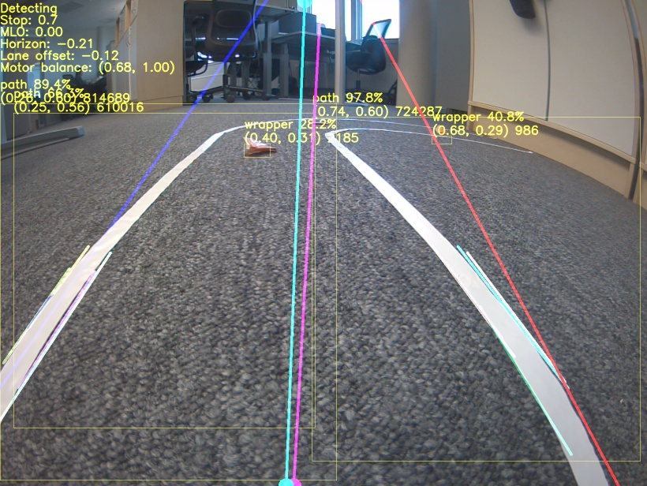

# JETANK Path Cleaner

This project enables the JETANK to follow a path and clear objects that are in the way.
The object detection uses DetectNet and a model trained from SSD-Mobilenet with transfer learning. The lane detection is based on applying edge detection in the regions identified as paths by DetectNet.



## Prerequisites
- [JETANK AI Kit](https://www.waveshare.com/jetank-ai-kit.htm)
- \>32 GB SD Card
- [JetBot SD Card Image](https://jetbot.org/master/software_setup/sd_card.html)

## Installation

### Setup JetBot

Flash the SD card according to the instructions at [JetBot - Software Setup (SD Card Image)](https://jetbot.org/master/software_setup/sd_card.html).

You may want to [expand the filesystem to fill the SD card](expand_sd.md).

For training it's recommended to [mount 4GB of swap space](https://github.com/dusty-nv/jetson-inference/blob/master/docs/pytorch-transfer-learning.md#mounting-swap).

### Setup JETANK
```
$ sudo git clone https://github.com/waveshare/JETANK.git
$ cd JETANK/
$ sudo chmod +x config.sh
$ sudo chmod +x install.sh
$ ./config.sh jetbot
reboot
```
In the jetbot docker container. Accessed via the Jupiter notebook terminal in a browser: \
Address: `<JetbotIP>:8888` \
Password: `jetbot`

```
$ cd JETANK/
$ ./install.sh
$ sudo chmod 666 /dev/ttyTHS1
```

### Install jetson-inference in the jetbot docker container
I found the easiest way to do this is [building the project from source](https://github.com/dusty-nv/jetson-inference/blob/master/docs/building-repo-2.md) in the notebook terminal.

### Clone the repo
```
$ git clone https://gitlab.com/eivaun.experis/jetank-path-cleaner.git
```

## Usage
Run the notebook in the jetbot container. \
See [Usage](usage.md) for more details.

## Video
https://youtu.be/nnxIErPTU_k

## Contributors
Eivind Vold Aunebakk