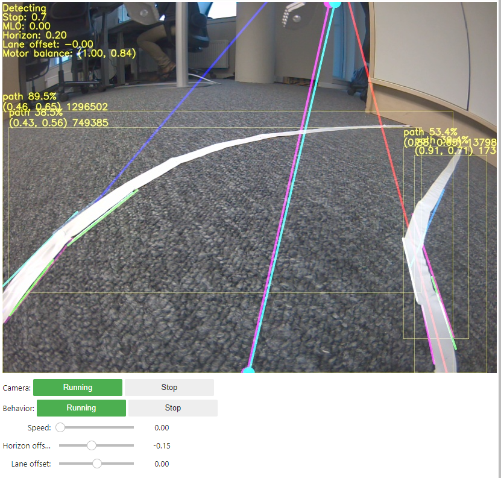

# Usage

The program is run through the JupiterLab instance in the jetbot container. It can be accessed in a web browser at: \<JetbotIP\>:8888 where \<JetbotIP> is the IP-address of the device.

## Controls

- The camera and processing loop can be enabled and disabled with the buttons.
- The behavior buttons can be used to set the robot in an idle state without disabling the camera.
- The max speed and steering adjustments can be set with the sliders.

## The overlay

- The current running state and any additional information related to it is displayed in the top left.
- Any detected paths and obstacles are highlighted with yellow rectangles.
- While driving:
    - The blue line is the detected left lane.
    - The red line is the detected right lane.
    - The purple line is the calculated center lane.
    - The cyan line is a smoothed version of the purple line. The end points of this is feed to the steering.

## Config
Numerous other configuration options are available at the top of the notebook.
